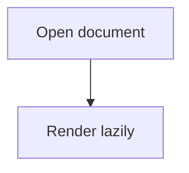
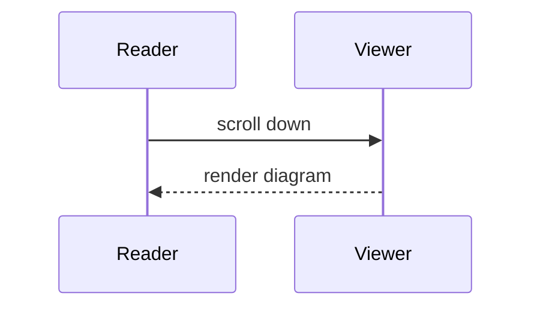

# Mermaid Fixture



## Invalid diagram

The block below is intentionally malformed and must surface a visible,
non-fatal failure state instead of breaking the Document.

```mermaid
flowchart TD
  A[Unclosed --> ===> not mermaid
```

## Filler prose

Paragraph 1: filler prose that pushes the final diagram far below the first viewport so lazy rendering has something real to defer.

Paragraph 2: filler prose that pushes the final diagram far below the first viewport so lazy rendering has something real to defer.

Paragraph 3: filler prose that pushes the final diagram far below the first viewport so lazy rendering has something real to defer.

Paragraph 4: filler prose that pushes the final diagram far below the first viewport so lazy rendering has something real to defer.

Paragraph 5: filler prose that pushes the final diagram far below the first viewport so lazy rendering has something real to defer.

Paragraph 6: filler prose that pushes the final diagram far below the first viewport so lazy rendering has something real to defer.

Paragraph 7: filler prose that pushes the final diagram far below the first viewport so lazy rendering has something real to defer.

Paragraph 8: filler prose that pushes the final diagram far below the first viewport so lazy rendering has something real to defer.

Paragraph 9: filler prose that pushes the final diagram far below the first viewport so lazy rendering has something real to defer.

Paragraph 10: filler prose that pushes the final diagram far below the first viewport so lazy rendering has something real to defer.

Paragraph 11: filler prose that pushes the final diagram far below the first viewport so lazy rendering has something real to defer.

Paragraph 12: filler prose that pushes the final diagram far below the first viewport so lazy rendering has something real to defer.

Paragraph 13: filler prose that pushes the final diagram far below the first viewport so lazy rendering has something real to defer.

Paragraph 14: filler prose that pushes the final diagram far below the first viewport so lazy rendering has something real to defer.

Paragraph 15: filler prose that pushes the final diagram far below the first viewport so lazy rendering has something real to defer.

Paragraph 16: filler prose that pushes the final diagram far below the first viewport so lazy rendering has something real to defer.

Paragraph 17: filler prose that pushes the final diagram far below the first viewport so lazy rendering has something real to defer.

Paragraph 18: filler prose that pushes the final diagram far below the first viewport so lazy rendering has something real to defer.

Paragraph 19: filler prose that pushes the final diagram far below the first viewport so lazy rendering has something real to defer.

Paragraph 20: filler prose that pushes the final diagram far below the first viewport so lazy rendering has something real to defer.

Paragraph 21: filler prose that pushes the final diagram far below the first viewport so lazy rendering has something real to defer.

Paragraph 22: filler prose that pushes the final diagram far below the first viewport so lazy rendering has something real to defer.

Paragraph 23: filler prose that pushes the final diagram far below the first viewport so lazy rendering has something real to defer.

Paragraph 24: filler prose that pushes the final diagram far below the first viewport so lazy rendering has something real to defer.

Paragraph 25: filler prose that pushes the final diagram far below the first viewport so lazy rendering has something real to defer.

Paragraph 26: filler prose that pushes the final diagram far below the first viewport so lazy rendering has something real to defer.

Paragraph 27: filler prose that pushes the final diagram far below the first viewport so lazy rendering has something real to defer.

Paragraph 28: filler prose that pushes the final diagram far below the first viewport so lazy rendering has something real to defer.

Paragraph 29: filler prose that pushes the final diagram far below the first viewport so lazy rendering has something real to defer.

Paragraph 30: filler prose that pushes the final diagram far below the first viewport so lazy rendering has something real to defer.

Paragraph 31: filler prose that pushes the final diagram far below the first viewport so lazy rendering has something real to defer.

Paragraph 32: filler prose that pushes the final diagram far below the first viewport so lazy rendering has something real to defer.

Paragraph 33: filler prose that pushes the final diagram far below the first viewport so lazy rendering has something real to defer.

Paragraph 34: filler prose that pushes the final diagram far below the first viewport so lazy rendering has something real to defer.

Paragraph 35: filler prose that pushes the final diagram far below the first viewport so lazy rendering has something real to defer.

Paragraph 36: filler prose that pushes the final diagram far below the first viewport so lazy rendering has something real to defer.

Paragraph 37: filler prose that pushes the final diagram far below the first viewport so lazy rendering has something real to defer.

Paragraph 38: filler prose that pushes the final diagram far below the first viewport so lazy rendering has something real to defer.

Paragraph 39: filler prose that pushes the final diagram far below the first viewport so lazy rendering has something real to defer.

Paragraph 40: filler prose that pushes the final diagram far below the first viewport so lazy rendering has something real to defer.

Paragraph 41: filler prose that pushes the final diagram far below the first viewport so lazy rendering has something real to defer.

Paragraph 42: filler prose that pushes the final diagram far below the first viewport so lazy rendering has something real to defer.

Paragraph 43: filler prose that pushes the final diagram far below the first viewport so lazy rendering has something real to defer.

Paragraph 44: filler prose that pushes the final diagram far below the first viewport so lazy rendering has something real to defer.

Paragraph 45: filler prose that pushes the final diagram far below the first viewport so lazy rendering has something real to defer.

Paragraph 46: filler prose that pushes the final diagram far below the first viewport so lazy rendering has something real to defer.

Paragraph 47: filler prose that pushes the final diagram far below the first viewport so lazy rendering has something real to defer.

Paragraph 48: filler prose that pushes the final diagram far below the first viewport so lazy rendering has something real to defer.

Paragraph 49: filler prose that pushes the final diagram far below the first viewport so lazy rendering has something real to defer.

Paragraph 50: filler prose that pushes the final diagram far below the first viewport so lazy rendering has something real to defer.

Paragraph 51: filler prose that pushes the final diagram far below the first viewport so lazy rendering has something real to defer.

Paragraph 52: filler prose that pushes the final diagram far below the first viewport so lazy rendering has something real to defer.

Paragraph 53: filler prose that pushes the final diagram far below the first viewport so lazy rendering has something real to defer.

Paragraph 54: filler prose that pushes the final diagram far below the first viewport so lazy rendering has something real to defer.

Paragraph 55: filler prose that pushes the final diagram far below the first viewport so lazy rendering has something real to defer.

Paragraph 56: filler prose that pushes the final diagram far below the first viewport so lazy rendering has something real to defer.

Paragraph 57: filler prose that pushes the final diagram far below the first viewport so lazy rendering has something real to defer.

Paragraph 58: filler prose that pushes the final diagram far below the first viewport so lazy rendering has something real to defer.

Paragraph 59: filler prose that pushes the final diagram far below the first viewport so lazy rendering has something real to defer.

Paragraph 60: filler prose that pushes the final diagram far below the first viewport so lazy rendering has something real to defer.

## Far below the viewport


